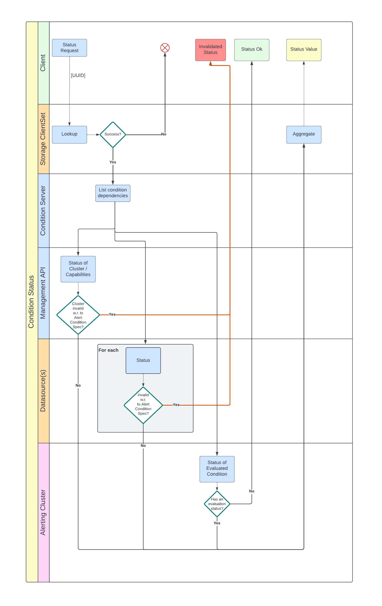

## Title

Alert Condition Status Optimizations

## Summary

Getting the status of a single alarm isn't expensive, however getting the status of many alarms at once can be an expensive process -- hurting UX & scalability.

## Use case

Customers scale up to many alarms & want to check their status.

## Benefits

- Optimize Opni Alerting resource usage
- Improved user experience when using the Alerting UI

## Impact

- Status will no longer be fine grained, as Alert Status will be periodically batched across various sources

## Implementation details

### Current

### Proposed

Backends like Cortex and AlertManager return raw lists of data when getting states -- the Alerting Plugin caches these API calls based on service descriptor / HTTP path and serves their data in memory.

In addition, calls to a particular Alarm's status are cached to avoid traversing many long lists of raw information.

The new `ListStatus` API handles listing the Condition Specs and Getting the Status in the same operation for both convenience and performance.

#### Caching

Caching will be implemented using interceptors over the protocols Opni uses

##### GRPC

- delegate caching to a GRPC `unary interceptor` registered to gateway totem server, to have a caching mechanism available for all RPCs
- api's handle their own caching via setting trailers with metadata that tells the interceptors whether or not to cache
- definitions & helper methods for GRPC caching interceptors will go in `pkg/util/grpc.go`

#### HTTP

- standard library `net/http` transport layer for caching implementation, similar to https://pkg.go.dev/github.com/gregjones/httpcache#Cache
- definitions & helper methods for HTTP caching interceptors will go in `pkg/util/http.go`

####

## Acceptance criteria

- [ ] Implement generic GRPC caching interceptors
- [ ] Implement generic HTTP caching interceptors
- [ ] Attach caching interceptors on specific protocol calls needed for Status() API
- [ ] `ListStatus()` ConditionServer API which batches ListConditions() & Status() calls.
- [ ] Attach caching interceptor implementations (read-through refresh interval) on both `Status()` and `ListStatus()`

## Supporting documents

Addresses https://github.com/rancher/opni/wiki/Alerting-Condition-Server#performance-issues

## Dependencies

None

## Risks and contingencies

| Risk                                                          | Contingency                                                                             |
| ------------------------------------------------------------- | --------------------------------------------------------------------------------------- |
| The cache isn't populated -- therefore calls remain expensive | Populate cache when the alerting plugin starts / once the Alerting Cluster is installed |

## Level of effort

~ 2 weeks

- 3 days cache interceptor definitions
- 3 days cache interceptor implementations on APIs
- 2 days `ListStatus` API
- 1-2 days explicit load testing & tweaking caches

## Resources

1 Upstream Opni Cluster
